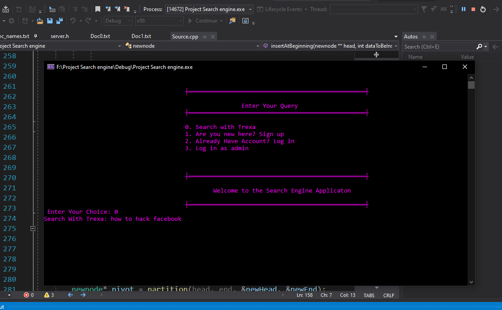
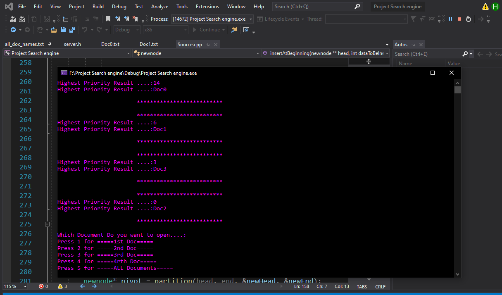
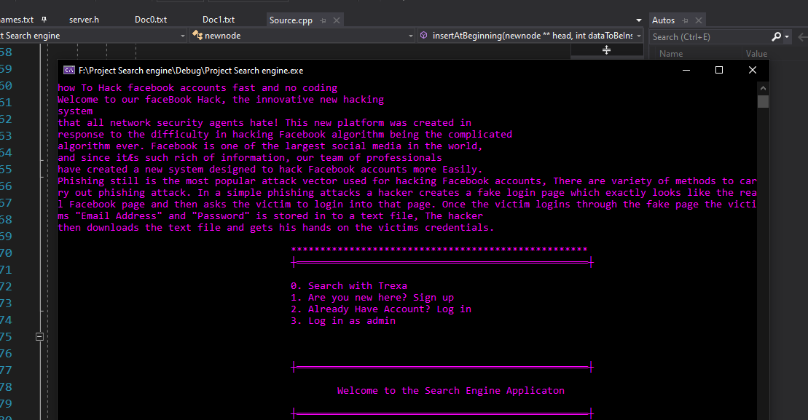

# Searc-Engine-in-C++

## Summary:
Here  we develop a Search Engine Using Linked list  has ability to do read files efficiently and rank all the server files Immediately also open the file on the basis of greater frequency .

### For Example:
If user come with his query and the server has data to solve this query also there a lot of files that stores data but it shows the file that has greater frequency for this.
      
## Features

As we make a great effort in coding of search engine So our search engine has followings characteristics:

- Takes query from user and performs various operations on it	
- Read Files Efficiently.
- Write data on files efficiently
- Having ability to create a C-Panel like in websites.
- Also our searching Engine contains an ability of BLOGING.
- Our Search Engine contains also History of user.
- Also it ranks files on the basis of Frequency and open document with respect to user choice.

## Our Project Contains :

- Dynamic Linked List.
- Delete Data from Link List.
- Quick Sort Algorithm.
- Array Data Structure.

| Plugin | README |
| ------ | ------ |
| Searching Screen |  |
| After Counting Frequancy the Ranked Docs are |  |
| Result |  |
